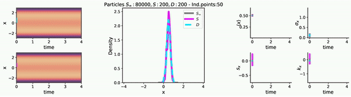
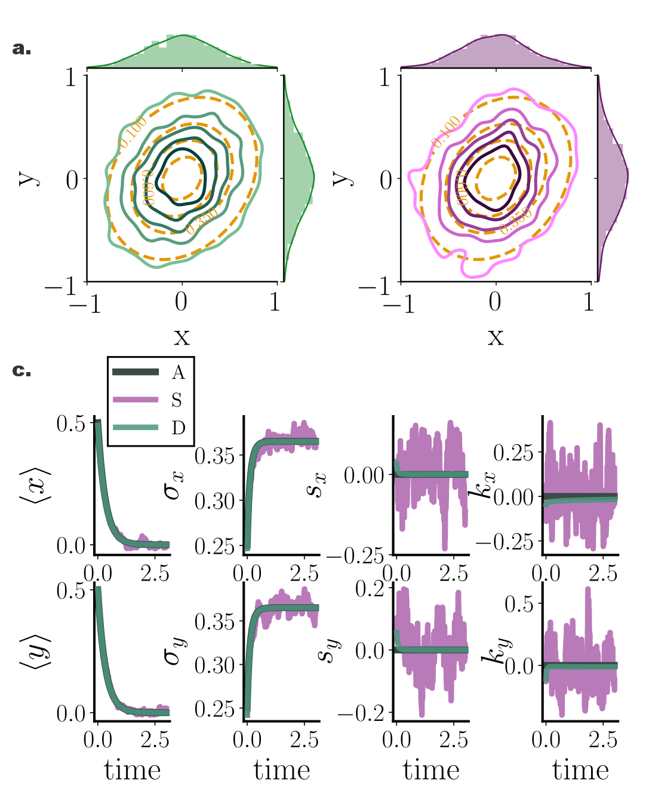
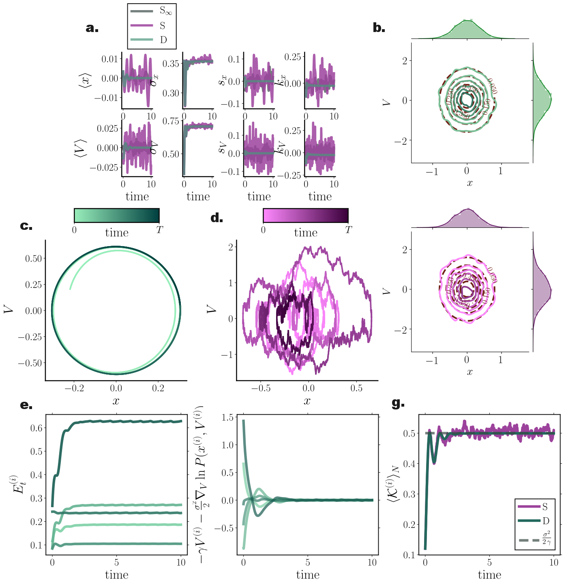

# Deterministic particle dynamics for simulating Fokker-Planck probability flows 


Read [here](https://gitlab.com/dimitra-maoutsa/odes_for_sdes/-/blob/master/README.md) the properly rendered readme file for now...


(under construction -  for more detailed info please read the [relevant article](https://www.mdpi.com/1099-4300/22/8/802/htm))


**Particle-based** framework for simulating **solutions of Fokker–Planck equations** that
- is **effortless** to set up
- provides **smooth transient solutions**
- is **computationally efficient**.


## A. **From SDEs to ODEs**
  - ### Systems with additive noise
     Consider a stochastic system described by the SDE 
      <p align="center">
     
     </p>
      The temporal evolution of the probability density of the system state is captured by the Fokker-Planck equation (FPE)

      <p align="center">
       
      </p>
      
      The FPE may be re-written in the form of a **_Liouville equation_**  
      ```diff
      ! [Eq.(3-5) in the main text]
      ```
      <p align="center">
      </p>
      </p>

      which in turn may be viewed as an evolution equation of the probability distribution of a statistical ensemble of **N** **_deterministic_** dynamical systems of the form _[Eq.(4-5) in the main text]_ 
  
      <p align="center"> 
      
      </p>
      
      with i=1,...,N.

  - ### Systems with multiplicative noise
    
      In a similar vain, for **_state dependent_** diffusion 

      <p align="center">
      
   
      the associated deterministic particle dynamics are 
      <p align="center">
      

      which, by setting  become 
      ```diff
      ! [Eq.(53) {in the main text] 
      ```


      <p align="center">
      

  Eq.(1) and Eq.(2) imply that we may obtain transient solutions of the associated FPEs by simulating ensembles of **deterministic** trajectories/particles with initial conditions drawn from the starting distribution $p_0(x)$. 

  **However, the deterministic particle dynamics in Eq.(1) and Eq.(2) require the knowledge of $\nabla_x \ln p_t(x)$, i.e. the gradient of the logarithm of the quantity of interest. 
  Enter the gradient-log density estimator (score function estimator)!**


## B. **Gradient-log-density (score function) estimator**

## C. **Smooth transient solutions of Fokker-Planck equations**










**Citations:**

1. Maoutsa, Dimitra; Reich, Sebastian; Opper, Manfred. [**Interacting Particle Solutions of Fokker–Planck Equations Through Gradient–Log–Density Estimation.**](https://www.mdpi.com/1099-4300/22/8/802/htm) _Entropy_ 2020, 22, 802. 

2. Hyvärinen, Aapo. **Estimation of non-normalized statistical models by score matching.** _Journal of Machine Learning Research_ 2005, 695-709.

